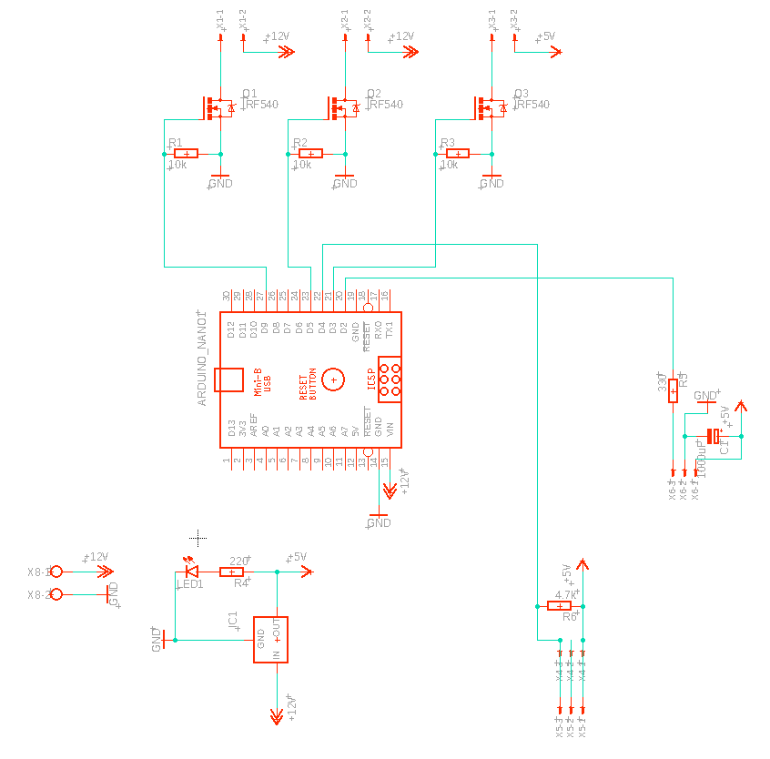

# imMobilize Electronics

For accurate timing of a range of stimuli, and logging of temperature data during an experiment, we use a microcontroller on a custom circuit board. The circuit schematic can be seen below. 

|Name|Part|
|----|----|
|R1-R3|10 kOhm|
|R4|220 Ohm|
|R5|330 Ohm|
|R6|4.7 kOhm|
|Q1-Q3|FQP30NO6|
|L1| Blue 5mm LED|
|C1| 1000 uF capacitor| 
|IC1|TRS 1-2450|
|X1-X6| Molex wire-to-board|
|X8| 2 pin screw terminal|




## Wiring Directions


```python

```
