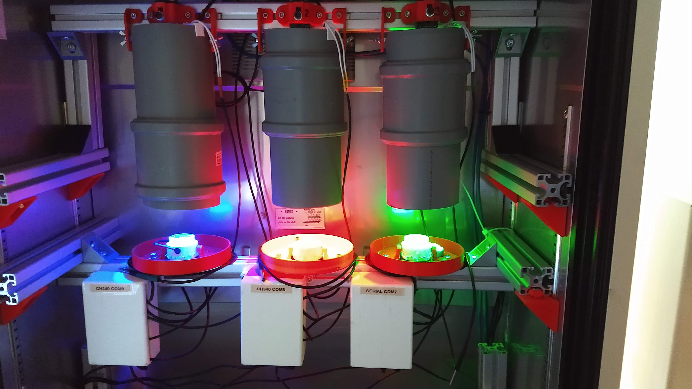

NOTE: This guide is currently under development!


# imMobilize Hardware Guide 

We aim to make imMobilize a platform that is easily built, adapted and expanded on by anyone. In this hardware section we publish our stl-files, schematics and partnumbers. 

## Cameras and Optics
Each system in equiped with a DMK-UP1300 usb3 camera from [The Imaging Source](http://www.theimagingsource.com), using a MVL75M1 objective on a 25mm extension tube. Each lens is fitted with a longpass filter in a [custom filter holder](https://github.com/DanielDondorp/imMobilize/blob/master/Hardware/STL_files/Illumination/IRFilterholders.stl).

## Electronics
The stimuli hardware and thermometers are driven with an arduino nano microcontroller that communicates with the imMobilize software running on the computer. For a guide on the required circuit, please look at the provided [Electronics Guide](https://github.com/DanielDondorp/imMobilize/blob/master/Hardware/electronics_guide.md).

## Setup

Our setups are built inside an incubator using 4040 aluminium profile bars for the structure. Individual imaging arenas are shielded from external light using 110mm PVC pipes.



```python

```
